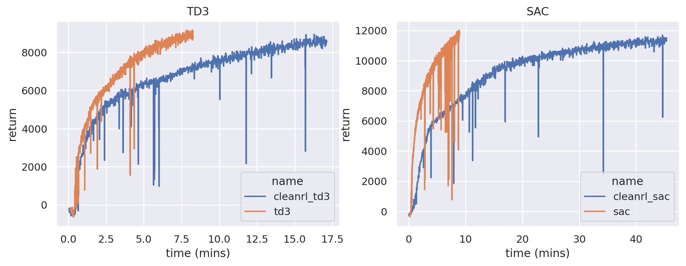
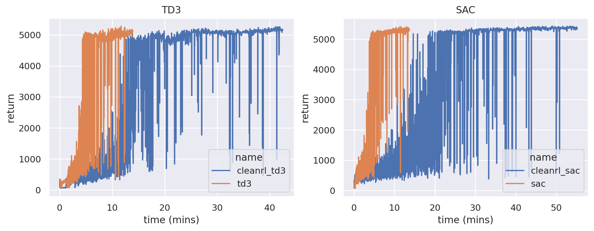
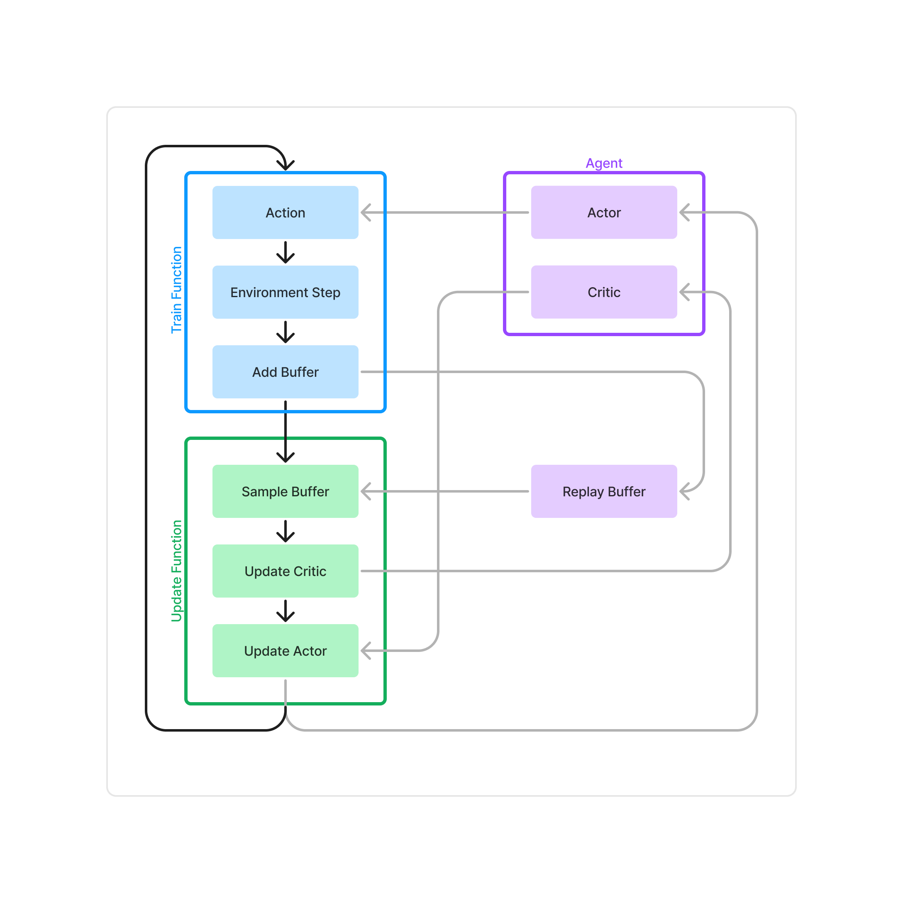

# tiny-rl
Single file implementations of deep reinforcement learning algorithms, inspired by CleanRL. Algorithms are written in JAX such that the entire training loop can be compiled.
This allows for a significant speedup even in non-JAX environments.

## Getting started
Prerequisites
- Python >= 3.11

To install with pip
```
pip install -r requirements.txt
```

To install with conda
```
conda env create -f environment.yaml
```

To run an experiment and upload the results to wandb
```
python sac.py --env-id HalfCheetah-v4 --track --wandb-project cleanjaxrl-test
```

## Benchmarks
### HalfCheetah
<p align="center">
    
</p>

$2 \times$ faster than CleanRL's TD3 (in JAX) and $5 \times$ faster than CleanRL's SAC (in PyTorch)

### Humanoid
<p align="center">
    
</p>

$3 \times$ faster than CleanRL's TD3 (in JAX) and $4 \times$ faster than CleanRL's SAC (in PyTorch)

## Software Architecture
<p align="center">
    
</p>
